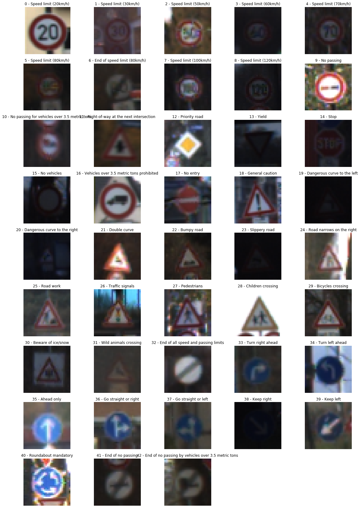
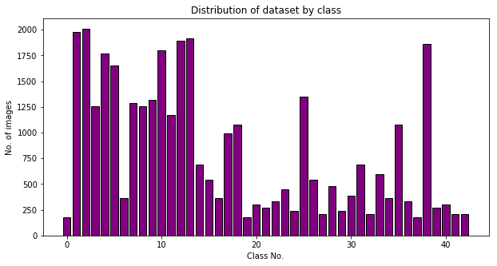
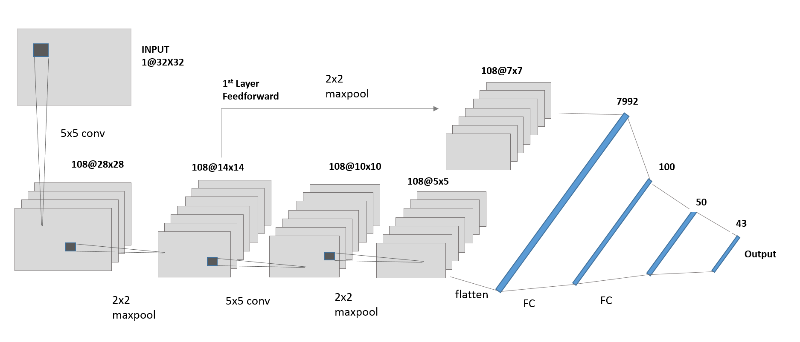
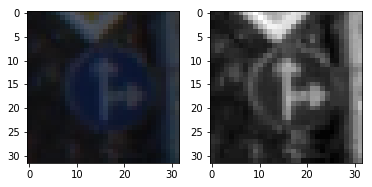
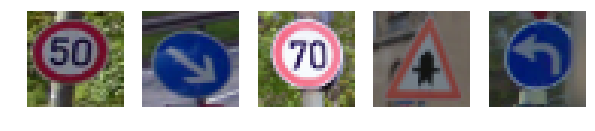
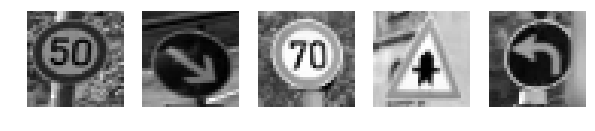
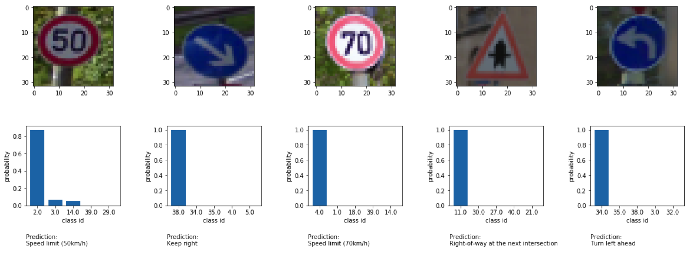

# Traffic-sign-classifier
The goal of this project is to train a convolutional nueral net in tensorflow to classify traffic sign images using logistic regression. The original data set for this multi-class classification is available [here](http://benchmark.ini.rub.de/?section=gtsrb&subsection=dataset) although a pickled dataset provided by Udacity is used for this implemetation.
Note that even though certain types of image classification problems(OCR etc.) using DL has exceeded human accuracy,it is not the case yet with traffic signs under real world scenarios that include different lighting conditions, wear&tear on signage and other obstacles. 

Key steps of this implementation are:
* Explore and visualize the german traffic sign dataset
* Design a logistic classification architecture 
* Build a image processing pipeline to generalize the data
* Implement a DNN using tensorflow
* Train and validate the model
* Test the model on captured images 

---
### Code

The python notebook `traffic_sign_classifier.ipynb` implements the dataset visualization, processing pipeline and the tensorflow model model. Implementation consists of the following files located in the source directory

* traffic_sign_classifier.ipynb     -   Implements CNN model and processing pipeline   
* out_images                        -   Folder with additional test images 
* writeup.md                        -   You are reading it

### Data exploration and visualization

The traffic sign dataset that we use for the project consists of a more than 50,000 images classified into 43 classes. A description of the classes are included below for reference. Each traffic sign image is a resized RGB image of 32x32x3 pixels. The dataset is split into training, validation and test datasets as shown below.    

|  Traffic Sign Dataset                      |
|:------------------------------------------:|
|    Training Set      :  34799              |
|    Validation Set    :  4410               |     
|    Test Set          :  12630              |
|    Classes           :  43                 |

Here is a random sample image from each of the 43 classes in the dataset. From these images, it is clear that the light conditions and clarity of the features in the image vary considerably. Looking at this a robust pre-processing pipeline is needed to accurately extract features from these images. As described later, the pre-processing consists of normalization and local contrast enhancement. There are a multitude of techniques in literature that can be further applied to enhance the quality of the dataset. This will be an interesting avenue to explore further.



Looking at the distribution of training set images by class, it is clear the distribution is not very uniform. There are certain classes of traffic signs that are underrespresented. Augmenting data in these underrespresented classes is nececessary to improve the overal test accuracy. Described below are images with 




### Model Architecture and Training

The model architecture is similar to the architecture proposed by Sermanet located [here](http://yann.lecun.com/exdb/publis/pdf/sermanet-ijcnn-11.pdf). While this paper seems to be a little dated, it was a great starting point for the model architecture that resulted in > 95% test accuracy just with a few tweaks. Most of the parameters such as learning rates, epochs, convolution window sizes and sampling  etc. were tweaked empirically. An interesting area to explore is to research the current state of the art architectures and the performance being achieved.

As shown in the paper, the final architecture implemented here is "Lenet with feed-forward connections". The intial stages consists of 2 convolutional layers with 5x5 convolution windows. Relu activation and 2x2 max pooling is applied after each conv. layer. The next stages have three FC layers with dropout to predict the final classification. In addition, the ouputs of first conv. layer is fed-forward to the FC stage after processing through an addition maxpooling stage. The idea here is that the information available post the first stage(which is higher level features and shapes) is preserved and given more weighting in output classification. While this trick may have been helpful in 2011 due to limited capability of running larger networks, it is not entirely clear whether the same performance cannot be achieved today by just employing a larger network with more trainable parameters.

The processing pipeline consits of converting the RGB image to gray scale, normalization and local contrast adjustment. The dataset was split into training, validation and test sets with the images in each set shown above. Training and validation losses were monitored to ensure that the model is not overfitting the data. To better generalize, dropout was used in the FC layers toward the output. It was also observed that 150 epochs of training are needed before the validation losses to flatten out and not overfit. Adam optimizer with a learning rate of 0.0001 was observed to settle slowly but give slightly better performance. There is room for more optimization - especially in terms of augmenting the training dataset using flipping the images and selective shadowing etc.

The classifier achieves a validation accuracy of >97% and a test accuracy of >95% with the architecture used. It easily detects images the are reasonably clear , but often gives wrong predictions when the images were captured at complex angles, shadows or when signs are stacked. Performance in each of these scenarious can be further improved by augmenting the data and better processing techniques. While there are no plans to improve the model further, this was a good learning exercise to understand the importance of quality input data.

### Final Model 

The final model architecture is located in the file `traffic_sign_classifier.ipynb` and is shown below. As mentioned above, it consists of 2 convolution layers followed by 3 FC layers. Each convolution layers is followed by a Relu activation layers and a max pooling layer. The convolution windows are 5x5 and pooling windows are chosen to be 2x2. In addition, the output of the first stage (after pooling) is fed into first FC layer. 

```python
   from tensorflow.contrib.layers import flatten

   def LeNet(x, dr1, dr2):    
        # Arguments used for tf.truncated_normal, randomly defines variables 
        # for the weights and biases for each layer
        mu = 0
        sigma = 0.1
    
        # Layer 1: Convolutional. Input = 32x32x1. Output = 28x28x6.
        conv1_W = tf.Variable(tf.truncated_normal(shape=(5, 5, 1, 108), mean = mu, stddev = sigma))
        conv1_b = tf.Variable(tf.zeros(108))
        conv1   = tf.nn.conv2d(x, conv1_W, strides=[1, 1, 1, 1], padding='VALID') + conv1_b

        # Activation.
        conv1 = tf.nn.relu(conv1)

        # Pooling. Input = 28x28x6. Output = 14x14x6.
        conv1 = tf.nn.max_pool(conv1, ksize=[1, 2, 2, 1], strides=[1, 2, 2, 1], padding='VALID')

        # Layer 2: Convolutional. Output = 10x10x16.
        conv2_W = tf.Variable(tf.truncated_normal(shape=(5, 5, 108, 108), mean = mu, stddev = sigma))
        conv2_b = tf.Variable(tf.zeros(108))
        conv2   = tf.nn.conv2d(conv1, conv2_W, strides=[1, 1, 1, 1], padding='VALID') + conv2_b
    
        # Activation.
        conv2 = tf.nn.relu(conv2)

        # Pooling. Input = 10x10x16. Output = 5x5x16.
        conv2 = tf.nn.max_pool(conv2, ksize=[1, 2, 2, 1], strides=[1, 2, 2, 1], padding='VALID')

        # Flatten. Input = 5x5x16. Output = 400.
        fc0   = flatten(conv2)
    
        #Feedforward with or without additional 2nd stage subsampling
        fc0_multi = tf.nn.max_pool(conv1, ksize=[1, 2, 2, 1], strides=[1, 2, 2, 1], padding='VALID')
        fc0_multi = flatten(fc0_multi)
        #fc0_multi = flatten(conv1)
        
        fc0 = tf.concat(1,[fc0,fc0_multi])
        #print(fc0.get_shape())
        # Without 2nd stage subsampling 14x14x108+5x5x108 = 21168+2700 = 23868
        # With additional 2nd stage subsampling 7x7x108+5x5x108 = 5292+2700 = 7992
    
    
        # Layer 3: Fully Connected. Input = 400. Output = 120.
        fc1_W = tf.Variable(tf.truncated_normal(shape=(7992, 100), mean = mu, stddev = sigma))
        fc1_b = tf.Variable(tf.zeros(100))
        fc1   = tf.matmul(fc0, fc1_W) + fc1_b
    
        # Activation.
        fc1    = tf.nn.relu(fc1)

        #Dropout
        fc1    = tf.nn.dropout(fc1,dr1)
    
        # Layer 4: Fully Connected. Input = 120. Output = 84.
        fc2_W  = tf.Variable(tf.truncated_normal(shape=(100, 50), mean = mu, stddev = sigma))
        fc2_b  = tf.Variable(tf.zeros(50))
        fc2    = tf.matmul(fc1, fc2_W) + fc2_b
    
        # Activation.
        fc2    = tf.nn.relu(fc2)

        #Dropout
        fc2    = tf.nn.dropout(fc2,dr2)
    
        # Layer 5: Fully Connected. Input = 84. Output = 43.
        fc3_W  = tf.Variable(tf.truncated_normal(shape=(50, 43), mean = mu, stddev = sigma))
        fc3_b  = tf.Variable(tf.zeros(43))
        logits = tf.matmul(fc2, fc3_W) + fc3_b
    
        return logits
```

Here is a visualization of network and output from the model that shows the parameters in each layer. 



| Layer                    		|     Description	        					         | 
|:------------------------------:|:---------------------------------------------:| 
| Input           		         | 32x32x1 gray scale image   			   	      | 
| Convolution 5x5     	         | 1x1 stride, valid padding, outputs 28x28x108 	|
| RELU			   		         |												            |
| Max pooling 2x2	    	         | 2x2 stride,  outputs 14x14x108 				   |
| Convolution 5x5	               | 1x1 stride, valid padding, outputs 10x10x108  |    								         	|
| RELU            	            |         								         	   |
| Max pooling 2x2		            | 2x2 stride,  outputs 5x5x108         			|
| Feedforward Layer1 2x2 Maxpool | 2x2 stride, outputs 7x7x108 		         	|
| Flatten                     	| 5x5x108 + 7x7x108 = 7992 			            |
| Fully connected                | Input 7992, Output 100                        |
| Fully connected                | Input 100, Output 50                          |
| Softmax                        | Input 50, Output 43                           |

### Pre-processing Images

Again, like most machine learning problems, data processing - both augmenting data and pre-processing is critically important to get good performance out of the model. 

The first step involves converting the 32x32 RGB image into a grayscale image. 

```python
def pre_process(image):
    return cv2.cvtColor(image,cv2.COLOR_RGB2GRAY)
```

Next the images are normalized as shown below

```python
def normalize_img(image):
    norm_img = np.zeros(image.shape)
    return cv2.normalize(image,norm_img,alpha=0.0,beta=1.0,norm_type=cv2.NORM_MINMAX, dtype=cv2.CV_32F)
```
Experiments were also done with adding an additional processing step of improving local contrast in the images

```python
def exp_equalize(image):
    return exposure.equalize_adapthist(image)
```
Below is a sample image before and after normalization



These three processing steps are sufficient to get reasonably good validation and test accuracies (>95%). Further areas to explore are in augmenting the data, especially the techniques below can be quite easily implemented. 
1. Flipping each image along the vertical axis
2. Changing the angle of the images

### Running the pipeline and testing 

The images are read in batches of 128 and processed using the routines described above. About 150 -200 epochs were needed to get good performance especially since a slower learning rate of 0.0001 was being used as shown below.

```python
   for i in range(EPOCHS):
        X_train, y_train = shuffle(X_train, y_train)
        for offset in range(0, num_examples, BATCH_SIZE):
            end = offset + BATCH_SIZE
            batch_x, batch_y = X_train[offset:end], y_train[offset:end]
            sess.run(training_operation, feed_dict= \
               {x: batch_x, y: batch_y, keep_prob_fc1: drop1, keep_prob_fc2: drop2})
            
        validation_accuracy = evaluate(X_valid, y_valid, 1.0, 1.0)
        print("EPOCH {} ...".format(i+1))
        print("Validation Accuracy = {:.3f}".format(validation_accuracy))
        print()
        
    saver.save(sess, './lenet_final')
    print("Model saved")
```    

After about 200 epochs, the validation accuracy of about 98% is achieved. Running this on the test set, an accuracy of ~96% is achieved.

### Testing the model on new images

Test images were collected from google maps in Europe, cropped, resized to 32x32x3 pixels and fed to the model. Shown below are a few images captured.



Here are the same images after pre-processing



And the result from the CNN, it can be seen that the model classifies the images accurately. 



The top 5 softmax probabilities associated with each of these images is shown below. The top probability is close to 1 indicating that in most cases, the model is easily able to recognize the images. This is due to the image quality being good - clean angles under good light conditions. 

Image1

|    Prob.        |   Prediction          |
|:---------------:|:---------------------:|
|    99.753%      | Speed limit (50km/h)  |
|    0.184%       | Stop                  |
|    0.042%       | Keep left             |
|    0.021%       | Speed limit (30km/h)  | 
|    0.000%       | Speed limit (60km/h)  |


For the rest of the images, the classifier was able to accurately identify them correctly with high certainity

Image2

|    Prob.          |   Prediction            |
|:-----------------:|:---------------------------:|
|    100.000% | Keep right           |
|    0.000%   | Turn left ahead      |
|    0.000%   | Stop                 |
|    0.000%   | Speed limit (60km/h) |
|    0.000%   | End of all speed and passing limits|


Image3

|    Prob.          |   Prediction            |
|:-----------------:|:------------------------------:|
|    99.996%  | Class: Speed limit (70km/h)    |
|    0.004%   | Class: Speed limit (30km/h)    |
|    0.000%   | Class: Speed limit (20km/h)    |
|    0.000%   | Class: Go straight or left     |
|    0.000%   | Class: General caution         |


Image4

|    Prob.          |   Prediction                                     |
|:-----------------:|:-----------------------------------------------:|
|    100.000% | Class: Right-of-way at the next intersection    |
|    0.000%   | Class: Beware of ice/snow                       |
|    0.000%   | Class: Turn right ahead                         |
|    0.000%   | Class: Double curve                             |
|    0.000%   | Class: Pedestrians                              |


 Image5

|    Prob.          |   Prediction                 |
|:-----------------:|:----------------------------:|
|    99.999%  | Class: Turn left ahead       |
|    0.001%   | Class: Keep right            |
|    0.000%   | Class: Ahead only            |
|    0.000%   | Class: Go straight or right  |
|    0.000%   | Class: Speed limit (60km/h)  |

---

### Discussion and further work
This project is a good introduction to Tensorflow and classification using convnets. Many mentioned above, improvements can be seen especially in the areas of augmenting (flip, shear, blur images) and pre-processing (. Another area that can be looked into is to look into the current state-of-art architectures in classification, their accuracy and implementing one at some point in the future.
